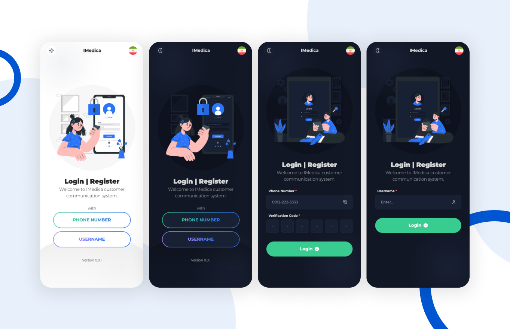

[](https://lunanezha.com/)
[](www.linkedin.com/in/luna-nezha/)

# **IMEDICA**

A modern, mobile-first login interface built with cutting-edge web technologies. Designed for flexibility and responsiveness, this application supports multiple themes, multi-language functionality, and a user-friendly drawer menu.
The **iMedica Login** leverages AI to provide medication management services for patients and doctors. This project focuses solely on the login functionality, delivering a sleek, responsive, and mobile-first interface to authenticate users securely.



## 🛠 **Features**

- **Theme Support**: Easily switch between light and dark themes.
- **Multi-Language Support**: Built-in internationalization with `i18next` for seamless multi-language functionality.
- **Drawer Menu**: A user-friendly navigation drawer for intuitive app interaction.
- **Mobile-First Design**: Optimized for mobile devices to ensure smooth usability.
- **Responsive**: Fully responsive design that adapts to various screen sizes and devices.

## **💻 Tech Stack**

- **[Ionic](https://ionicframework.com/)**: For building cross-platform, high-quality mobile applications.
- **[Tailwind CSS](https://tailwindcss.com/)**: For utility-first, responsive styling.
- **[Vite](https://vitejs.dev/)**: A fast build tool and development server.
- **[PostCSS](https://postcss.org/)**: For modern CSS transformations.
- **[i18next](https://www.i18next.com/)**: For robust internationalization.
- **[TypeScript](https://www.typescriptlang.org/)**: For type-safe and scalable development.

## 🚀 **Run Locally**

Clone the project

```bash
  git clone https://link-to-project
```

Go to the project directory

```bash
  cd my-project
```

Install dependencies

```bash
  npm install
```

Start the server

```bash
  ionic serve
```

## ✅ **Running Tests**

To run tests, run the following command

```bash
  npm run test
```

## 🤝 **Contributing**

Contributions are always welcome!

If you’d like to improve this project:

- Fork the repository.
- Create your branch: git checkout -b feature/your-feature.
- Commit your changes: git commit -m "Add your message".
- Push to the branch: git push origin feature/your-feature.
- Open a Pull Request.

## 💡 **Support**

For support, email mahdie.nezhadhosseini@gmail.com.

## 📝 **License**

This project is licensed under the
[MIT](https://choosealicense.com/licenses/mit/) License. See the LICENSE file for details.
